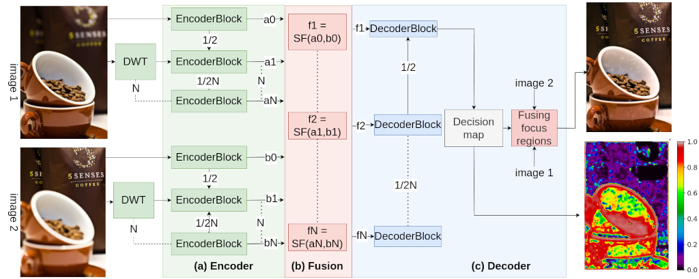
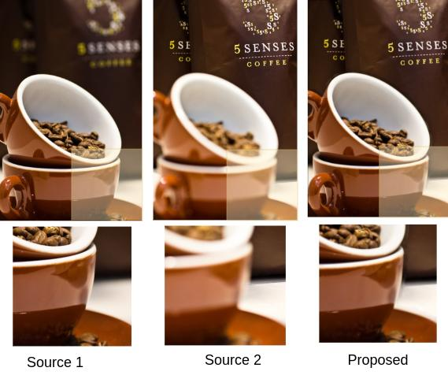

# Multi-Focus Image Fusion Using Deep Learning  

## **Overview**  
Multi-focus image fusion addresses the challenge of combining multiple images of a scene, each focused on different regions, into a single, fully focused image. This project introduces a novel deep-learning-based approach that leverages a custom architecture, **PDMNet**, to achieve state-of-the-art performance in image fusion tasks.

### **Why Multi-Focus Image Fusion?**  
Capturing a fully focused image is often impossible due to the **defocus spread effect**, where objects at varying depths appear blurry. Multi-focus image fusion combines the best-focused regions of multiple input images into one fully focused output. This is crucial in domains like:  
- **Medical Imaging**  
- **Microscopy**  
- **Photography**

---

## **Methodology**  

### **1. Feature Extraction and Transformation**  
The project introduces **PDMNet**, a custom neural network designed to enhance fusion quality. Key innovations include:  
- Integration of **Discrete Wavelet Transform (DWT)** to capture multi-scale and frequency-domain features.  
- Effective encoding of focused regions from multiple input images.

### **2. Image Reconstruction**  
Reconstruction involves merging the extracted features from PDMNet to create a single, fully focused image.  

The entire process is illustrated in the workflow diagram below:  

---

## **Results**  
This approach achieved a **0.061% improvement in SSIM (Structural Similarity Index)** compared to existing state-of-the-art methods, demonstrating superior fusion quality.  

### **Visualization of Results**  
Below are sample results showcasing the effectiveness of the proposed method:  

---

## **Conference and Review**  
This work was presented at the **5th International Conference on Data Science and Applications (ICDSA 2024)** and is currently **under review** for publication.

---

## **Technologies and Tools**  
- **Deep Learning Framework:** PyTorch  
- **Custom Network Architecture:** PDMNet  
- **Discrete Wavelet Transform (DWT)**  
- **Performance Metric:** Structural Similarity Index (SSIM)

---

